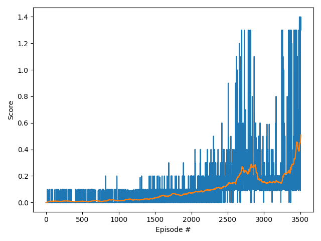

# Report: Collaboration and Competition project

This project contains a solution the multi-agent "Tennis" environment, with 2 agents that are both collaborating and 
competing in order to rally a tennis ball back and forth.

The MADDPG algorithm for multi-agent reinforcement learning was used to solve the environment in **3506** episodes of training, 
see [Results](#Results) section for details on performance. The implementation of MADDPG is described below.

## Implementation
The key to MADDPG is that information from the policies of _all_ agents is used to update each agent, that way the agents
training can take into account the predicted actions of other actions (this prevents problems with non-stationarity that
occur with multi-agent reinforcement learning). In order to allow this the code is structured with a top level `MADDPG` class 
(in `src/main/maddpg.py`) which contains both individual agents, which are instances of the `DDPG` class, because they are essentially
just DDPG agents themselves. Each DDPG agent has both actor and critic networks, with target and local instances.

The training loop in the MADDPG _train()_ function runs many episodes, the _run_episode()_ function gets actions from the 
local actors of both agents, then passes these to the environment and stores all the relevant data (states, actions, rewards, next_states and dones) 
for each timestep in the replay buffer, so it can be used for training.
It returns the scores for each agent for the episode, the overall episode score is then calculated as the max score across both agents.

Periodically the `update_agent_networks()` function is called, this period is controlled by a hyperparameter (see hyperparameters section below).
This runs the update function a given number of times (also configured as a hyperparameter) which updates the actor and critic networks for both agents.

### Update function
The core update function for each agent works as follows, the code for this is in the function `MADDPG.update_single_agent()`:
- get a minibatch of experience samples from the replay buffer
- calculate the next target actions for **both** agents, using their target actor network and the states from the replay buffer sample.
- For each agent update the local critic network: 
  - pass the concatenated states and actions for **both** agents to the target critic network to calculate `Q_targets_next`
  - calculate `Q_targets` using the rewards for that agent and `Q_targets_next`
  - calculate `Q_expected` using the agents local critic
  - calculate the MSE loss between `Q_targets` and `Q_expected` and minimise this loss. I also experimented with smooth Huber loss however I found this did not work well.
- For each agent update the local actor network:
  - calculate the next actions for **both** agents, using their local actor networks and the states from the sample. I had to make sure to call PyTorch `detach()` function on the action result
 of the other agent, so that it wasn't included in the gradient calculation.
  - calculate the actor loss by passing the concatenated states and predicted actions for **both** agents to the local critic network
  - minimise this actor loss
- Then after the updates to the local networks have been applied, soft update the target networks for both actors and critics.

There were some other notable features of the algorithm that I experimented with:

Exploration noise: I added Ornstein-Uhlenbeck process noise to make sure the agents explored properly initially. 
This was linearly decreased each episode, the rate of this decrease was configured with the `noise_end_episode` hyperparameter. 
A minimum amount of noise was retained after this had finished decreasing. This noise was also scaled by an initial amount, set by the 
`noise_coefficient` hyperparameter.

I also experimented with adding noise to the parameter weights of the neural networks, however it seemed like this harmed training performance, so this is now
turned off.

#### Wrapping as a gym environment
The unity environment was wrapped as an OpenAI gym environment, which encapsulates the unity specific code and results in tidier
code in the actual algorithm, as well as better portability between algorithms. Specifically it was wrapped as a gym `VectorEnv` environment, 
which is an extension of the normal `gym.Env` designed for parallel environments that represent multiple environments at once, eg. they take a stacked vector of actions and 
return a stacked vector of observations and rewards. This obviously fits well with this Tennis Unity environment, since it runs both agents at once and 
returns corresponding vectors.

#### Reward scaling
I found that multiplying the rewards returned from the environment by a constant factor of 10.0 improved training performance. 
To account for this when reporting the score for each episode I divided the score for the episode by a factor of 10.0, 
which should result in an equivalent score as if receiving the unscaled rewards from the environment.

#### Neural Net Architecture
The neural net architectures are the same for both actor and critic. They are Multi-layer perceptrons with two hidden layers, both of size 64.
The only difference is that the actor network has a `tanh` activation at the output, to ensure that the actions are between -1 and 1. 

The input size of the critic network corresponds to the combined states and actions for both agents, as these are concatenated before
being input to the critic network.

Apart from the `tanh` at the actor output, all the other activations are `ReLU`. I experimented with using `tanh` activations everywhere but I
found that it did not improve performance.

I also used "dropout" layers between each linear layer in both actor and critic networks, the dropout percentage can be controlled as a hyperparameter. 
Using dropout seemed to make the training more robust.

For initialising the weights the default PyTorch initialisation is used, I experimented with explicit initialisation but I found it
did not increase performance.

## Training 
The training was stopped when the average score for the last 100 episodes was greater than the 
`reward_threshold` of 0.5. When the average score achieves this threshold the 
training is automatically halted, and the final weights of the neural networks are written to a file. 
Additionally the current weights of the local network were periodically stored to a checkpoint file, in order to 
have a record of the weights during training. 

The "Adam" optimizer was used to update the parameters for both neural networks (actor and critic), see the hyperparameters section below 
for values.

#### Hyper-parameters
The following table lists all the relevant hyperparameters for this MADDPG implementation. The values below were found to give good 
performance, and these were used for the final run which generated the the score plot in the results section:

Hyperparameter | Description | Value
--- | --- | ---
gamma | Discount factor | 0.95 
network_update_period | how many episodes between updating the networks | 1
num_network_updates | how many times to update actor and critic networks | 5
buffer_size | replay buffer size | 1e6
batch_size | minibatch size of samples from replay buffer | 1024 
tau | rate of mixing for soft update of target parameters | 1e-2
learning_rate_actor | ADAM learning rate for actor network | 1e-3 
learning_rate_critic | ADAM learning rate for critic network | 2e-3 
noise_end_episode | the episode at which to stop linearly decreasing noise | 600  
noise_coefficient | the starting multiplier for the OU noise | 5.0 
dropout_p | probability used for all dropout layers | 0.1
activation | The activation function for both neural networks | ReLU

### Results
The target score of 0.5, averaged over 100 timesteps, was reached in **3506 episodes**. The score seemed to increase
fairly consistently, if quite slowly, over the course of the training, and appeared to be on an upward trajectory when the 
training was automatically halted because it had reached the target. I'm confident that with more 
hyperparameter tuning this agent could reach good performance much faster.

Subjectively the performance on the task is still not great, the agents are able to achieve rallies of a few hits back and forth,
but they still do not seem to have attained natural looking good performance on the task. However given that the average score
was still improving at the end of the training run, this gives confidence that better performance could be achieved by 
training for longer or with better hyperparameter tuning.

### Ideas for future work
This project achieved the target score and had acceptable performance using MADDPG, with the performance still improving at the
end of the training run. With further hyperparameter tuning I suspect this performance could be achieved in fewer episodes. It would
be a good idea to try automated hyperparameter tuning, for example using a black box optimisation algorithm such as bayesian optimisation.

I would be particularly interested to experiment further with the neural network architecture, for example different sizes of layers. 
It may also be valuable to try Batch Normalisation, to improve stability.

There is also further experimentation that could be done with the reward values. Currently each agent only receives its individual reward value,
which is used to update the critic network. However given that the agents are supposed to be collaborating, it might make sense to pass some combination
of the rewards for both agents, for example a weighted sum that still weights the agent's individual reward more heavily, but takes into account the reward for the 
other agent. The degree of weighting could then be tuned to correspond to more or less collaboration.